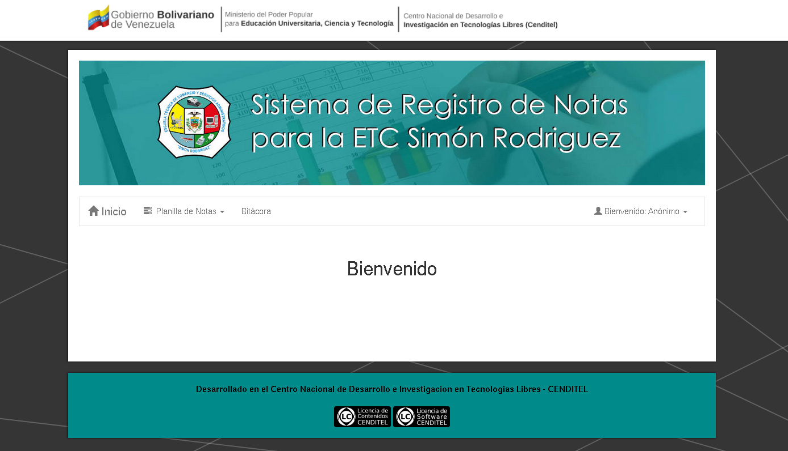

<h1>Sistema de registro de notas para la ETC Simón Rodriguez.</h1>

<hr />

## Autores
```
Ing. Argenis Osorio
Tec. Medio Luis Márquez
Tec. Medio Daniel Contreras
```

## Paquetes requeridos
```
Python==2.7
Django==1.8.8
```

## Instalación del entorno de desarrollo, usando entornos virtuales
```
Usaremos # para los comandos como superusuario

Usaremos $ para los comandos como usuario regular

# apt-get install python-virtualenv python-pip

$ virtualenv mi_env

$ source mi_env/bin/activate

$ cd sistema_notas_etcsr

$ pip install -r requirements.txt

$ cd sistema_notas_etcsr

$ cp settings.py_example settings.py

$ cd ..

$ bash reset_db.sh

$ python manage.py runserver
```

## Capturas



